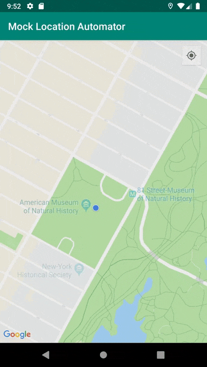

# Mock Location Automator
[](https://codecov.io/gh/SaeedMasoumi/mock-location-automator)
[](https://bintray.com/smasoumi/maven/mock-location-automator/_latestVersion)

Enabling mock locations for [LocationManager](https://developer.android.com/reference/kotlin/android/location/LocationManager) and [FusedLocationProvider](https://developers.google.com/location-context/fused-location-provider/) before running any Android instrumentation tests.

It providers a Junit-rule to grant needed permissions by executing adb commands and setting mock mode enabled for different location providers.




## Download

```groovy
dependencies {
    androidTestImplementation 'io.saeid.automator:mock-location-automator:0.5.0'
}
```
## Example
```kotlin
@RunWith(AndroidJUnit4::class)
@LargeTest
class YourScenarioTest {

    @get:Rule
    val mockLocationRule = MockLocationRule()
    
    @Test
    fun test_scenario_x() {
        // ...
        mockLocation(latitude, longitude)
        // ...
    }
}
```

## Usage

### Apply MockLocationRule

In order to use this library, you must add `MockLocationRule` into your test class.

This rule do the following steps:

1. Add test apk to `Settings > Developer Options > Select Mock location app`, So all mock locations can be applied from test classes.
2. Grant `android.permission.ACCESS_FINE_LOCATION` and `android.permission.ACCESS_COARSE_LOCATION` to avoid any permission errors.

### Mock a single point

You can mock a location by calling `mockLocation` method. To avoid jumping back to the real position, It will preserve it periodically.
 
 If you don't want this behaviour, you can simply disable preserving mode:
  
```kotlin
mockLocation(latitude = 12.45, longitude = 56.78, preserve = false)
```

### Mock multiple points

You can also mock multiple locations by passing a list of `DelayedLocation`. It will mock each location after a deplay which specified in the `DelayedLocation`.

Here is an example:
```kotlin
mockLocations(
    listOf(
        DelayedLocation(location1, 1000),
        DelayedLocation(location2, 2000),
        DelayedLocation(location3, 3000)
   )
)
```

So after the execution of this method, `location1` will be applied after 1 second, then 3 seconds (1+2) later `locations2` will be applied and so on.
